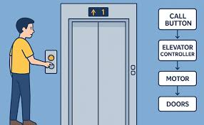

# Elevator Logic

A simple RTL implementation of an elevator logic. 

 

 

__Features:__
1.  If the elevator is going up, only upwards-going requests from the floors yet to come are serviced.
2.  If the elevator is going down, only downwards-going requests from the floors yet to come are serviced.
3.  If the elevator is stationary, it can go up or down to service a request.
4.  Elevator remains stationary at the last serviced floor. 

### Files:
- __elevator_tb.sv__: Testbench
- __ElevatorLogic.sv__: Elevator logic RTL implementation.
- __elevator.vcd__: Value change dump file. 