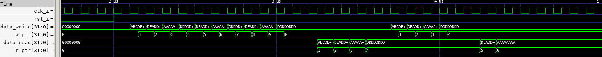

# Synchronous FIFO (First-In First-Out) 
A simple-parameterized-synchronous FIFO module. 

For the above trace:
- FIFO length = 10
- Data size = 32 bits
  
### Files:
- __Fifo.sv__: FIFO module.sv
- __fifo_tb.sv__: Testbench
- __fifo.vcd__: Value change dump