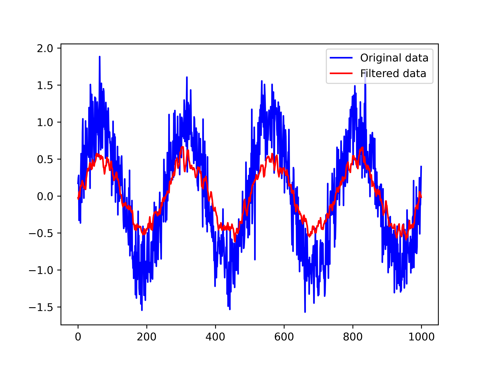

# Moving Average FIR Filter

8th order filter with 8 bits coefficients, 16 bits input, 32 bits output. 

### Files:
- __original.data__: Test data.
- __filtered.data__: Filtered data.
- __script.py__: Generates test data, retrieves filtered data and plots them.
- __MavgFilter.sv__: FIR filter logic.
- __fir_filter_mavg_tb.sv__: Testbench file.
- fir.vcd__: Value change dump file. 