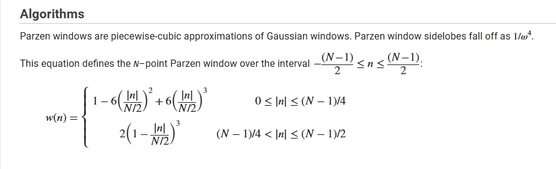

# Parzen Window

## Files:

- __ParzenWindow_NP.sv__ : Trivial implementation of *parzen* window logic, without pipelining. (10+16) bits fixed number representation employed.
- __triangle.sv__: Triangle wave generator.
- __parzen_tb.sv__: Testbench.
- __parzen_dut.vcd__: Value change dump file. 